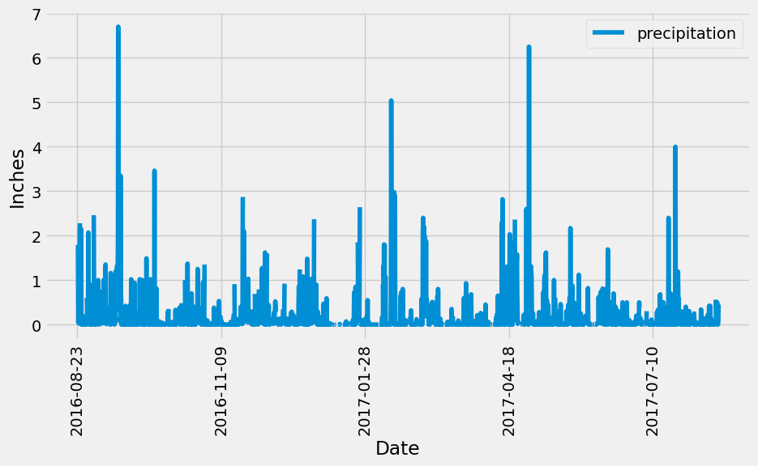
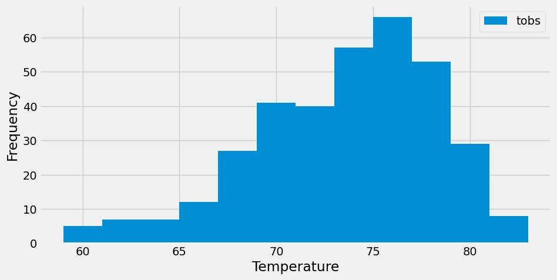

# SQLAlchemy-Challenge

## Background
In this assignment, we were tasked with utilizing a SQL database to analyze the climate throughout a period of time in Hawaii. By utilizing SQLAlchemy within python we were able to properly query our data for specific results and chart them into graphs for better visualization of the results. Alongside that, we were tasked with using Flask to properly create an HTML link to follow that will include a JSONified list of our database and can be specified to search for certain parameters. 

## Exploratory Precipitation Analysis:
In this section of the code, we were utilizing the data within our database to properly answer the questions provided. We started by utilizing SQLAlchemy to create an engine referencing our database and then linking that to variable in order to query it later. Once we created the link between python and our database, we were able to query the database for the most recent date, the first date in it, and then all 12 months of the year between the two. We also made sure to filter our query for the precipitation so that we could properly compare it over the course of those 12 months. After collecting that information, we plotted it into a bar graph as shown below to create a better visualization. 

After that, we finished off this section by using the describe function to find all of the summary statistics for our database. 

## Exploratory Station Analysis:
In this section, we did similar tasks to above but we were using our station variable and table. It was started by figuring out how many stations we had in our data, and then getting their unique descriptors such as ID to show. Once we had the ID, we found the lowest, highest, and average temperature at the most active station utilizing the func.min, func.max, and func.avg functions. We utilized that information to graph a histogram of the results as seen below. 

## App.py
Finally, we were ready to utilize what we had just done to create routes through Flask to an HTML. We followed similar steps by creating an engine, and making sure to link our database to python. After that, the homepage was created with references to each of the available routes you can take in our program. There were 5 routes in total: Precipitation, Stations, Tobs, Start, and Start/End. The first 3 routes were made into JSON lists that showed the most recent 12 months of precipitation as found in the precipitation analysis, the information we found in the station analysis, and the total observations in the most recent 12 months. The other two links were extensions to our HTML link where you could enter in the specific date and the low, high, and average temperatures would be provided. Or you could enter in a start date and end date to get a range of information. 

Code was written by following examples in the solutions to in class activites provided by UO Data Analytics Bootcamp. Starter code was also provided along with two CSV files and SQL database used. 
